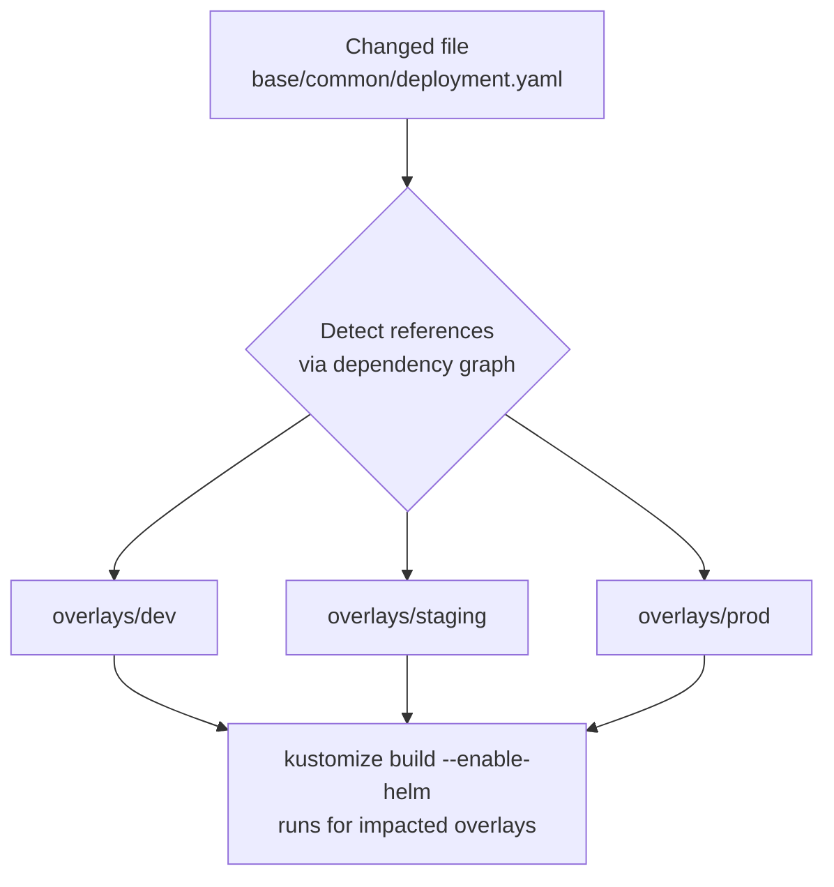

# Kustomize Build Check Action

<!-- [](https://github.com/marketplace/actions/kustomize-build-check-action) -->
[](LICENSE)

Automatically discover and validate Kustomize overlays and bases with intelligent change detection.

## Overview

When working with Kustomize in GitOps workflows, changes to a base can break multiple overlays that depend on it. This action:

- 🔍 **Auto-discovers** all Kustomize files in your repository
- 🧠 **Smart testing**: Only validates what changed
  - Base modified → tests all dependent overlays
  - Overlay modified → tests only that overlay
  - Resource modified → tests any kustomization referencing it
- ⚡ **Helm support**: Built-in `--enable-helm` flag support
- 📊 **Clear feedback**: Shows exactly which builds failed and why
- 🏗️ **No configuration needed**: Works out of the box with any Kustomize structure

## Quick Start

checkout the [examples](examples.d/) directory for some common patterns.

The [basic action](examples.d/basic.yml) will automatically:
1. Detect what files changed in your PR
2. Find all Kustomize dependencies
3. Test only the affected overlays
4. Report clear results

## Example Output

<!-- TODO: change to a picture -->

```
🔍 Kustomize Build Check

📝 Detecting changed files...
   Found 2 changed files

🔎 Discovering kustomization files...
   Found 8 kustomization files

🕸️  Building dependency graph...

📊 Analyzing impact...
   3 kustomization(s) need testing:
     - overlays/dev
     - overlays/staging
     - overlays/prod

🔨 Running kustomize build...

Results:
✅ overlays/dev - Build successful (1.2s)
✅ overlays/prod - Build successful (1.1s)
❌ overlays/staging - Build failed (0.8s)
   Error: missing required field "spec.replicas" in Deployment "api"
   
Summary: 2 successful, 1 failed

❌ Some builds failed
```

## Inputs

| Input | Description | Default | Required |
|-------|-------------|---------|----------|
| `base-ref` | Base git reference to compare against | Auto-detect from PR or `HEAD~1` | No |
| `enable-helm` | Enable Helm chart inflation in builds | `true` | No |
| `fail-on-error` | Fail workflow if any build fails | `true` | No |
| `root-dir` | Root directory to search for Kustomize files | `.` | No |

## Outputs

| Output | Description |
|--------|-------------|
| `results` | JSON array of all build results |
| `failed-count` | Number of failed builds |
| `success-count` | Number of successful builds |
| `skipped-count` | Number of paths skipped because the change removed them |

### Skipped paths

A change that deletes or renames a kustomize directory leaves the old path in
the git diff, but there is nothing left to build there. Those paths are reported
as skipped and counted separately, so consolidating or removing overlays does
not fail the check.

Skipping applies only to paths that no longer exist. A directory that is still
present but no longer builds, including one that has lost its kustomization
file, is still reported as a failure.

## How It Works

the **smart impact analysis** behaves as follows:

```mermaid
flowchart TD
    A[Changed file<br/>base/common/deployment.yaml]
    B{Detect references<br/>via dependency graph}
    C1[overlays/dev]
    C2[overlays/staging]
    C3[overlays/prod]
    D[kustomize build --enable-helm<br/>runs for impacted overlays]

    A --> B
    B --> C1
    B --> C2
    B --> C3
    C1 --> D
    C2 --> D
    C3 --> D
```

The kustomize build binary intelligently determines what to test:

1. **Change Detection**: Uses `git diff` to find modified files between your branch and the base
2. **Discovery**: Recursively finds all `kustomization.yaml` files in your repository
3. **Dependency Mapping**: Builds a complete graph of overlay → base relationships
4. **Impact Analysis**: Determines which kustomizations are affected by the changes
5. **Validation**: Runs `kustomize build --enable-helm` only on affected paths
6. **Reporting**: Provides clear output with success/failure indicators

### What Gets Tested?

- **Base changes** → All dependent overlays are automatically tested
- **Overlay changes** → Only that specific overlay is tested
- **Resource changes** → Any kustomization referencing that resource is tested
- **No changes to Kustomize files** → Nothing is tested (fast pass)

## Custom Base Reference

Compare against a specific branch or commit:

```yaml
- uses: michielvha/kustomize-build-check-action@main
  with:
    base-ref: ${{ github.event.pull_request.base.sha }}
```

## use the output

output may be used in subsequent steps

```yaml
- name: Validate Kustomize
  id: kustomize-check
  uses: michielvha/kustomize-build-check-action@v1
  with:
    fail-on-error: false
  
- name: Process Results
  if: always()
  run: |
    echo "Failed builds: ${{ steps.kustomize-check.outputs.failed-count }}"
    echo "Successful builds: ${{ steps.kustomize-check.outputs.success-count }}"
    echo "Skipped paths: ${{ steps.kustomize-check.outputs.skipped-count }}"
    
    # Parse JSON results
    echo '${{ steps.kustomize-check.outputs.results }}' | jq '.'
```

## Specific Directory

Only check Kustomize files in a specific directory:

```yaml
- uses: michielvha/kustomize-build-check-action@v1
  with:
    root-dir: ./kubernetes
```

## Supported Repository Structures

Works with any Kustomize structure out of the box:

### Standard Layout
```
kubernetes/
├── base/
│   ├── common/
│   │   └── kustomization.yaml
│   └── database/
│       └── kustomization.yaml
└── overlays/
    ├── dev/
    │   └── kustomization.yaml
    ├── staging/
    │   └── kustomization.yaml
    └── prod/
        └── kustomization.yaml
```

### Flat Layout
```
kustomize/
├── base.yaml
├── dev.yaml
├── staging.yaml
└── prod.yaml
```

### Nested Components
```
manifests/
├── components/
│   ├── monitoring/
│   └── networking/
├── bases/
│   ├── app/
│   └── infra/
└── clusters/
    ├── cluster-1/
    └── cluster-2/
```

## Under the Hood

This action uses pre-built Docker images from the [kustomize-build-check](https://github.com/michielvha/kustomize-build-check) tool repository.

**Architecture:**
- **Tool Repository**: Contains Go source code, builds binaries and Docker images
- **Action Repository** (this repo): Clean interface referencing GHCR images

**Benefits:**
- Faster action execution (pre-built images)
- Clean separation of tool development and action interface
- Easy version pinning
- Multi-architecture support (linux/amd64, linux/arm64)

## Security & Performance

✅ **Pre-built Images**: Uses verified, multi-architecture images from GitHub Container Registry, pinned using SHA to ensure immutable version.  
✅ **Fast Execution**: No build time, pulls cached image.  
✅ **Minimal Permissions**: Only needs repository read access.  
✅ **Isolated**: Runs in Docker container, doesn't modify your repository.  

## Related Projects

- [kustomize-build-check](https://github.com/michielvha/kustomize-build-check) - Source code and CLI tool
- [Kustomize](https://github.com/kubernetes-sigs/kustomize) - Kubernetes native configuration management
- [Helm](https://helm.sh/) - The package manager for Kubernetes

## Contributing

Found a bug or have a feature request? Please open an issue in the [tool repository](https://github.com/michielvha/kustomize-build-check/issues).
