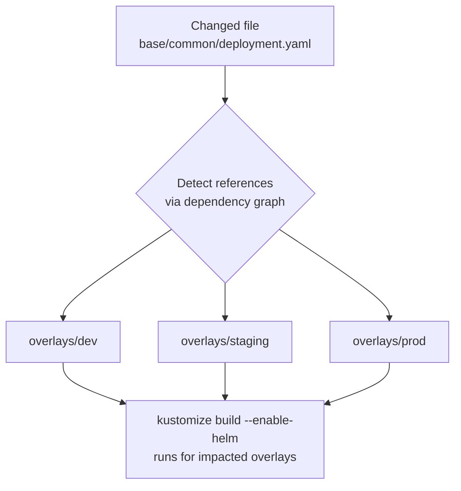

# Kustomize Build Check Action

<!-- [](https://github.com/marketplace/actions/kustomize-build-check-action) -->
[](LICENSE)

Automatically discover and validate Kustomize overlays and bases with intelligent change detection.

## Overview

When working with Kustomize in GitOps workflows, changes to a base can break multiple overlays that depend on it. This action:

- 🔍 **Auto-discovers** all Kustomize files in your repository
- 🧠 **Smart testing**: Only validates what changed
  - Base modified → tests all dependent overlays
  - Overlay modified → tests only that overlay
  - Resource modified → tests any kustomization referencing it
- ⚡ **Helm support**: Built-in `--enable-helm` flag support
- 📊 **Clear feedback**: Shows exactly which builds failed and why
- 🏗️ **No configuration needed**: Works out of the box with any Kustomize structure

## Quick Start

checkout the [examples](examples.d/) directory for some common patterns.

The [basic action](examples.d/basic.yml) will automatically:
1. Detect what files changed in your PR
2. Find all Kustomize dependencies
3. Test only the affected overlays
4. Report clear results

## Example Output

<!-- TODO: change to a picture -->

```
🔍 Kustomize Build Check

📝 Detecting changed files...
   Found 2 changed files

🔎 Discovering kustomization files...
   Found 8 kustomization files

🕸️  Building dependency graph...

📊 Analyzing impact...
   3 kustomization(s) need testing:
     - overlays/dev
     - overlays/staging
     - overlays/prod

🔨 Running kustomize build...

Results:
✅ overlays/dev - Build successful (1.2s)
✅ overlays/prod - Build successful (1.1s)
❌ overlays/staging - Build failed (0.8s)
   Error: missing required field "spec.replicas" in Deployment "api"
   
Summary: 2 successful, 1 failed

❌ Some builds failed
```

## Inputs

| Input | Description | Default | Required |
|-------|-------------|---------|----------|
| `base-ref` | Base git reference to compare against | Auto-detect from PR or `HEAD~1` | No |
| `enable-helm` | Enable Helm chart inflation in builds | `true` | No |
| `fail-on-error` | Fail workflow if any build fails | `true` | No |
| `root-dir` | Root directory to search for Kustomize files | `.` | No |

## Outputs

| Output | Description |
|--------|-------------|
| `results` | JSON array of all build results |
| `failed-count` | Number of failed builds |
| `success-count` | Number of successful builds |

## How It Works

the **smart impact analysis** behaves as follows:


The kustomize build binary intelligently determines what to test:

1. **Change Detection**: Uses `git diff` to find modified files between your branch and the base
2. **Discovery**: Recursively finds all `kustomization.yaml` files in your repository
3. **Dependency Mapping**: Builds a complete graph of overlay → base relationships
4. **Impact Analysis**: Determines which kustomizations are affected by the changes
5. **Validation**: Runs `kustomize build --enable-helm` only on affected paths
6. **Reporting**: Provides clear output with success/failure indicators

### What Gets Tested?

- **Base changes** → All dependent overlays are automatically tested
- **Overlay changes** → Only that specific overlay is tested
- **Resource changes** → Any kustomization referencing that resource is tested
- **No changes to Kustomize files** → Nothing is tested (fast pass)

## Custom Base Reference

Compare against a specific branch or commit:

```yaml
- uses: michielvha/kustomize-build-check-action@main
  with:
    base-ref: ${{ github.event.pull_request.base.sha }}
```

## use the output

output may be used in subsequent steps

```yaml
- name: Validate Kustomize
  id: kustomize-check
  uses: michielvha/kustomize-build-check-action@v1
  with:
    fail-on-error: false
  
- name: Process Results
  if: always()
  run: |
    echo "Failed builds: ${{ steps.kustomize-check.outputs.failed-count }}"
    echo "Successful builds: ${{ steps.kustomize-check.outputs.success-count }}"
    
    # Parse JSON results
    echo '${{ steps.kustomize-check.outputs.results }}' | jq '.'
```

## Specific Directory

Only check Kustomize files in a specific directory:

```yaml
- uses: michielvha/kustomize-build-check-action@v1
  with:
    root-dir: ./kubernetes
```

## Supported Repository Structures

Works with any Kustomize structure out of the box:

### Standard Layout
```
kubernetes/
├── base/
│   ├── common/
│   │   └── kustomization.yaml
│   └── database/
│       └── kustomization.yaml
└── overlays/
    ├── dev/
    │   └── kustomization.yaml
    ├── staging/
    │   └── kustomization.yaml
    └── prod/
        └── kustomization.yaml
```

### Flat Layout
```
kustomize/
├── base.yaml
├── dev.yaml
├── staging.yaml
└── prod.yaml
```

### Nested Components
```
manifests/
├── components/
│   ├── monitoring/
│   └── networking/
├── bases/
│   ├── app/
│   └── infra/
└── clusters/
    ├── cluster-1/
    └── cluster-2/
```

## Under the Hood

This action uses pre-built Docker images from the [kustomize-build-check](https://github.com/michielvha/kustomize-build-check) tool repository.

**Architecture:**
- **Tool Repository**: Contains Go source code, builds binaries and Docker images
- **Action Repository** (this repo): Clean interface referencing GHCR images

**Benefits:**
- Faster action execution (pre-built images)
- Clean separation of tool development and action interface
- Easy version pinning
- Multi-architecture support (linux/amd64, linux/arm64)

## Security & Performance

✅ **Pre-built Images**: Uses verified, multi-architecture images from GitHub Container Registry, pinned using SHA to ensure immutable version.  
✅ **Fast Execution**: No build time, pulls cached image.  
✅ **Minimal Permissions**: Only needs repository read access.  
✅ **Isolated**: Runs in Docker container, doesn't modify your repository.  

## Related Projects

- [kustomize-build-check](https://github.com/michielvha/kustomize-build-check) - Source code and CLI tool
- [Kustomize](https://github.com/kubernetes-sigs/kustomize) - Kubernetes native configuration management
- [Helm](https://helm.sh/) - The package manager for Kubernetes

## Contributing

Found a bug or have a feature request? Please open an issue in the [tool repository](https://github.com/michielvha/kustomize-build-check/issues).
